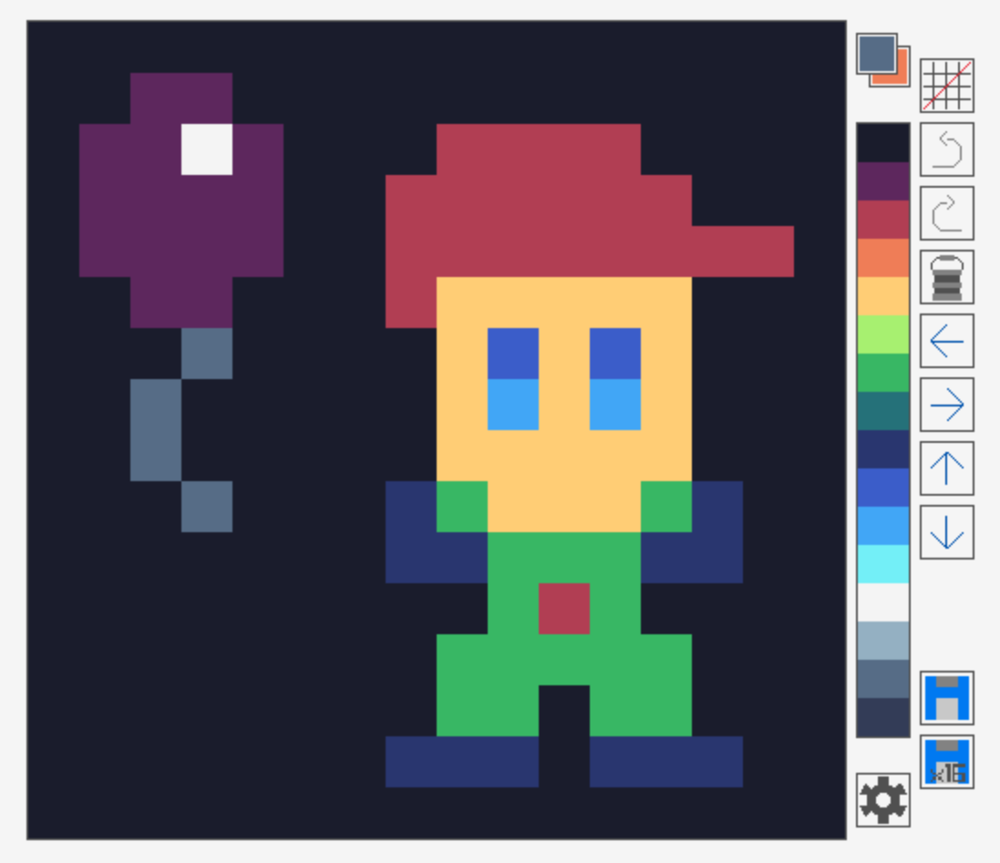

# Jolly Paint

This is a very minimalistic pixel art web editor.

You can try it [here](https://autopawn.itch.io/jolly-paint)!

# Compile from source

First run

    ./build_dependencies.sh

to get emscripten and compile raylib for web.

Then run

    ./compile.sh

to create index.zip.

You can run it in a local server using:

    python -m http.server 8080
